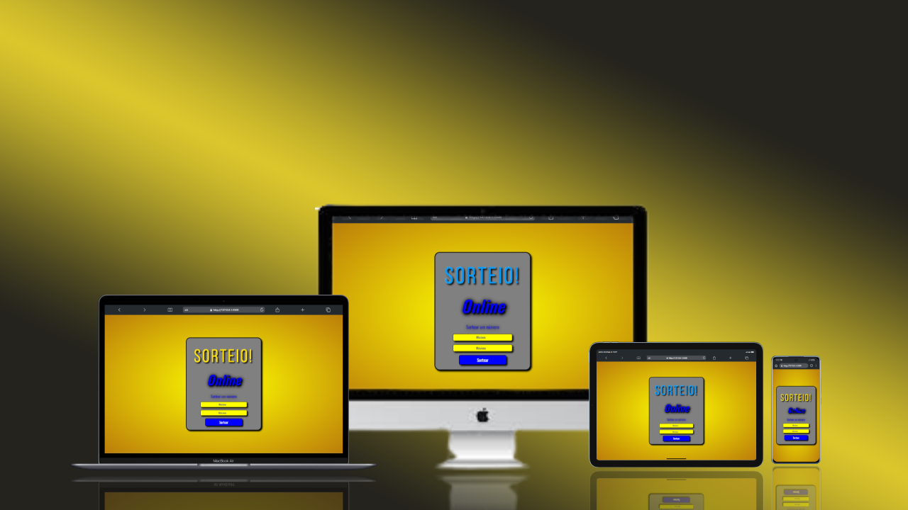

<h1><strong style="font-weight: 700">Projeto<strong> <u><i>Sorteio Online</i></u></h1>
 

## 📝  Sobre
Esse projeto foi feito logo no início  do módulo 3 de JavaScript. A essência desse projeto foi usar <i style="color: #772">"Math.random"</i> que tem como foco o arredondamento entre os números "0" e "1" juntamente com o cálculo: 

<i style="color:#772"  >"Math.floor(Math.random() * (max - min + 1) + min)"</i>

Com esse cálculo podemos escolher dois números entre "0" e outro qualquer, muito além de "1, 2, 3, 4...∞"

## 🖥 Tecnologias

Este projeto foi desenvolvido com VsCode, HTML, CSS e JavaScript.

<h3>Confira o resultado acessando <a href="https://jacksonrms.github.io/DevSorteio/">Sorteio Online.</a></h3>
 
